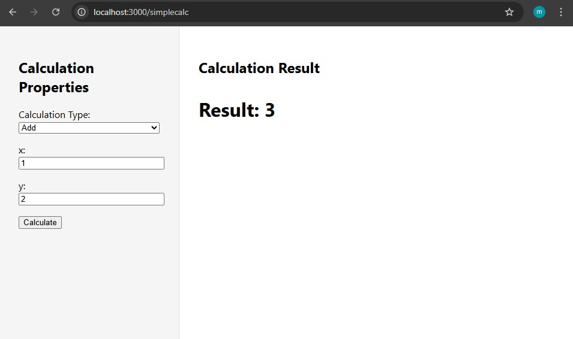
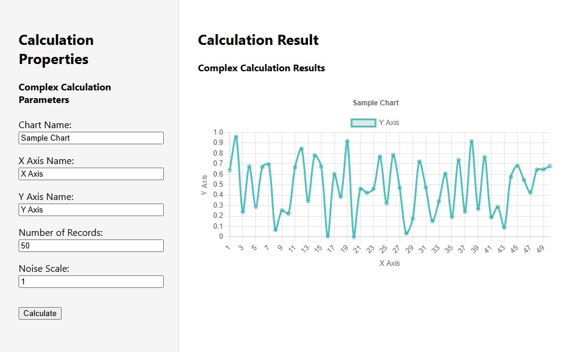

# MATLAB Web-App Project

This project demonstrates how to build a modern web application that exposes a library of MATLAB functions to users via a React frontend and a Python backend. The intent is to show how MATLAB's computational power can be integrated into a user-friendly, interactive web interface, making advanced calculations and charting accessible from any browser.

## Technologies Used
- **MATLAB**: Provides the core computational functions and algorithms.
- **Python**: Acts as the bridge between MATLAB and the web, using the MATLAB Engine API for Python.
- **FastAPI**: A modern, fast (async) Python web framework for building APIs.
- **React**: A popular JavaScript library for building responsive, interactive user interfaces.
- **Chart.js** (via CDN): Lightweight charting library for displaying results visually in the browser.

The application includes both simple and complex calculators, demonstrating parameter passing, result handling, and dynamic chart rendering.

## Screenshots

### Simple Calculator View

### Charting/Complex Calculator View

# setting up application
## setting up backend
### set up python venv
python -m venv venv

### activate python venv
venv\Scripts\activate     # Windows

### install python server tools
pip install fastapi uvicorn

### install setuptools for matlab backend
python -m pip install setuptools

### enable matlab backend engine
cd D:\matlab\extern\engines\python # replace with matlab install directory
python setup.py install

## setting up frontend
### install and setup react frontend
npx create-react-app frontend
cd frontend
npm install axios
npm install react-router-dom

## running application
### running backend
venv\Scripts\activate
cd backend
uvicorn app:app --reload --port 8000

### running frontend
cd frontend
npm start